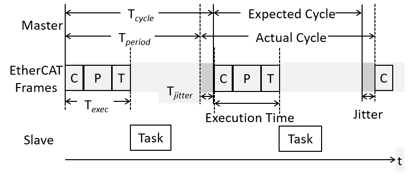

# LSECAT
Ethercat Servo LSmecapion

ZYBO-Z7-20, Beagle Bone Black 에서 LS mecapion 사의 L7N 이더캣 서보제어

## makefile 수정

|name| definition |
|--|--|
|XENOMAI_PATH | xenomai 경로|
|INC_ECAT     | ethercat 헤더 경로|
|LIB_DIR      | ethercat 라이브러리 경로|


## 실험 파라미터 변경

main.h

|name|definition |
|--|--|
|ECATCTRL_TASK_PRIORITY	| L7N 이더캣 서보를 제어하는 TASK 의 우선순위|
|CPUSPIN_TASK_PRIORITY	  | xenomai stress 를 주는 TASK 의 우선순위|
|ECATCTRL_TASK_PERIOD    | ECATCTRL_TASK 와 CPUSPIN_TASK 의 주기|
|SEC_DURATION            | 프로그램을 수행하는 시간(s) |
|CPUSPIN                 | define 되어 있을 경우 ECATCTRL_TASK 외에 xenomai stress TASK 추가로 생성|
|PROCESS                 | define 되어 있을 경우 ECATCTRL_TASK 에 우측의 연산과정추가 |
|ECATCTRL_TASK | 이더캣 서보를 제어하는 TASK|
|CPUSPIN_TASK  | 시스템에 부하를 주기 위해 만든 dummy TASK|


## 실행 방법

```
# ./bin/ecat-embedded StressTime(us) filename
```

|name| definition |
|--|--|
|StressTime(us) | CPUSPIN 이 define 되어 있을 경우 CPUSPIN_TASK 에서 지정한 시간(us) 만큼 cpu를 소모
|filename | ECATCTRL_TASK의 데이터가 저장될 파일명

```
ex) 250us(25%) xenomai stress 를 사용할 경우(CPUSPIN 을 define 함)
    # ./bin/ecat-embedded 250 xenomai_stress_250us.csv

    1ms 주기로 동작하는 2개의 task(ECATCTRL_TASK, CPUSPIN_TASK) 를 생성하고 
    CPUSPIN_TASK 에서는 250us 만큼 cpu 를 소모하도록 함
    250us/1ms * 100 = 25% cpu 사용
```

```
ex) xenomai stress 를 사용하지 않을 경우(CPUSPIN 을 define 하지 않음)
    # ./bin/ecat-embedded 0 no_xenomai_stress.csv

    1ms 주기로 동작하는 1개의 task(ECATCTRL_TASK) 를 생성하여 
    xenomai stress 를 적용하지 않은 상태로 테스트
```

아래 명령으로 TASK 들의 cpu 사용률을 관찰할 수 있다.

```
    # watch -n 1 "cat /proc/xenomai/stat" 
``` 

## 실행 결과
    프로그램 실행 때 지정한 이름의 파일로 ECATCTRL_TASK 의 데이터가 출력되고
    
    spintask_period.csv 파일 로 CPUSPIN_TASK 의 데이터가 출력된다.
    
    period, execution, jitter, collectTime, processTime, TranslateTime 순으로 데이터가 저장된다.

    

    
    
    
